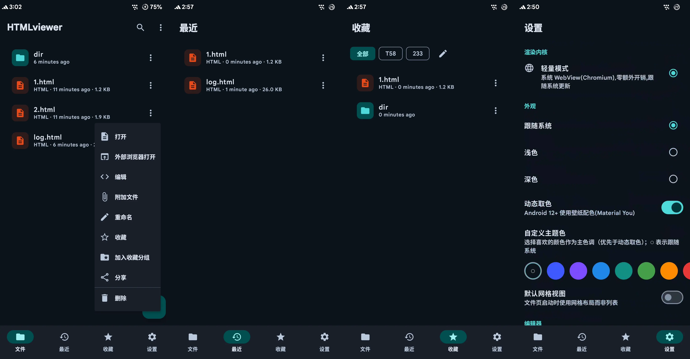
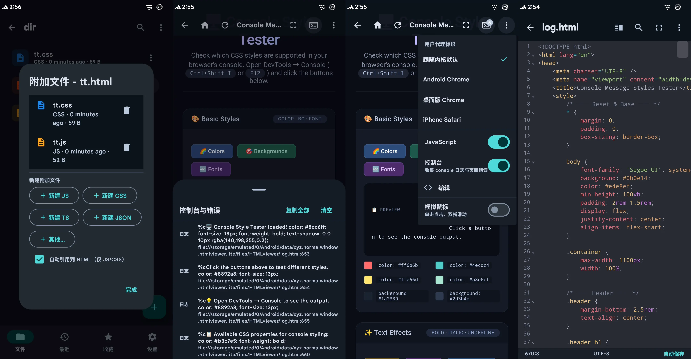

# NW-HTMLviewer

[中文](README.md) | **English**

<p align="center">
  
</p>

<p align="center">
  
  
  
  
</p>

<p align="center">
An industrial-grade mobile **HTML editor with fullscreen preview** app (native Material 3). Built-in CodeMirror 6 code editing, dual render engines (system WebView / GeckoView), offline resource caching and full file management.
</p>

<p align="center">
  
</p>

## Features

- **Code editing**: Built-in CodeMirror 6 (offline bundle) with HTML/CSS/JS syntax highlighting, line numbers, auto-indent, bracket matching, find & replace, undo/redo, one-click formatting (built-in prettier)
- **Fullscreen preview**: Immersive preview (system bars hidden), split-screen live preview (edit-and-see, debounced refresh) and fullscreen preview
- **Browser-style preview**: Back/forward/reload, UA switcher, JS toggle, immersive mode, simulated mouse (touchpad cursor / tap to click / two-finger scroll), console with error/warning drawer
- **Enhanced console**: Full console API interception — multiple arguments, `%s/%d/%i/%f/%o/%O` formatting, `%c` inline styles (color/background/bold/italic/underline) and expandable objects (like desktop DevTools); colored level badges for better distinction
- **Dual render engines**:
  - Lightweight mode: system WebView (Chromium, zero overhead)
  - Compatibility mode: built-in GeckoView 153 (independent engine, fixed rendering behavior, persistent disk cache)
- **Offline resource cache**: network resources (CDN, etc.) are saved to a hidden `.htmlviewer_cache` folder next to the HTML file after first download; reused offline when the URL is unchanged. Toggleable, manually cleanable
- **File management**: directory browsing, list/grid views, live search, recent files, favorites, multi-select batch operations (delete/move/copy/share), undoable delete (5s recycle bin), built-in templates
- **File/folder import**: import external files or whole folders into the current directory via the system document picker (SAF) — no storage permission needed, auto de-duplication
- **Encoding support**: auto-detects UTF-8/GBK/UTF-16 (BOM first), opens legacy GBK HTML files, one-click save as UTF-8
- **User-friendly settings**: theme (system/light/dark + dynamic color), 8 Material3 color schemes (TonalSpot/Neutral/Vibrant/Expressive/Rainbow/FruitSalad/Monochrome/Fidelity), custom theme color, editor font size/indent/auto-save/word wrap, immersive mode
- **Multi-language**: Simplified Chinese and English, switch instantly in settings (follow system / 中文 / English)

<p align="center">
  
</p>

## Tech Stack

| Component | Choice |
|---|---|
| UI | Jetpack Compose + Material 3 (dynamic color) |
| Architecture | MVVM + Repository + Hilt DI |
| Local storage | Room (file metadata) + DataStore (settings) |
| Editor | CodeMirror 6 (offline assets bundle) |
| Engine | WebView (Renderer abstraction) / GeckoView 153 |
| Build | Kotlin 2.3.21 / AGP 8.13 / KSP 2.3.11 / minSdk 26 / targetSdk 36 |

## Architecture

```
app/src/main/java/xyz/normalwindow/htmlviewer/
├── data/
│   ├── db/          Room: file metadata (favorites/recent/encoding/lines)
│   ├── settings/    DataStore: user preferences
│   ├── file/        FileRepository + encoding detection + recycle bin
│   ├── template/    built-in template library (assets/templates)
│   └── di/          Hilt modules
├── render/          Renderer abstraction: WebViewRenderer / GeckoRenderer
├── ui/
│   ├── home/        File manager home (4 tabs + multi-select + batch ops + import)
│   ├── editor/      CodeMirror editor + fullscreen/split preview
│   ├── settings/    Settings (engine/appearance/editor/preview/language)
│   ├── about/       About page (app info/GitHub/license/tech stack)
│   ├── navigation/  NavHost (home / about / editor / preview)
│   └── components/  Shared components (empty state/skeleton/file row)
├── util/            LocaleManager (in-app language switching)
└── theme/           Material 3 theme (dynamic color + 8 tonal schemes + dark/light)
```

Render engines are abstracted behind the `Renderer` interface: preview picks lightweight/compatibility engine per settings, providing `loadHtml/loadFile/reload/destroy`.

## Building

```bash
# Debug (China mirrors applied automatically)
./gradlew assembleDebug

# Unit tests
./gradlew testDebugUnitTest

# Release (split by ABI: arm64-v8a / armeabi-v7a / x86 / x86_64)
./gradlew assembleRelease

# Lite edition (system WebView only, no GeckoView, ~99% smaller)
./gradlew assembleLiteDebug
# or assembleLiteRelease (full edition defaults to assembleFullDebug/assembleFullRelease)
```

> Release builds use the debug signing key by default for local installs; configure a real keystore in `signingConfigs` before publishing.

## Release (v1.1.1)

- Artifacts are published on [GitHub Releases](https://github.com/normalwindow/NormlW-HTMLviewer/releases), split by ABI (arm64-v8a / armeabi-v7a / x86 / x86_64). **Download the arm64-v8a package** for most mainstream devices.
- Two editions:
  - **Full** (`1.1.0`): includes GeckoView compatibility engine, full features (~185 MB)
  - **Lite** (`1.1.1-lite`): system WebView only, ~99% smaller (~2.2 MB), no compatibility mode
- See [CHANGELOG.md](CHANGELOG.md) for version history.

## Rebuilding the CodeMirror bundle

```bash
cd editor-builder
npm install          # uses npmmirror registry
npm run build        # outputs to app/src/main/assets/editor/
```

## On-device verification checklist

- [x] Create/edit/save HTML, auto-save and manual save
- [x] Dark mode and dynamic color
- [x] Split live preview and fullscreen preview (immersive, toolbar toggle)
- [x] Switch to GeckoView engine in settings and preview works (first init is slower, expected)
- [x] Delete files with Snackbar undo
- [ ] GBK encoding open and convert to UTF-8
- [ ] Gecko engine stress test
- [ ] Old WebView version test

## TODO

- [x] Enhanced console (multi-args/formatting/%c styles/expandable objects/level badges)
- [x] Color schemes (8 Material3 tonal schemes)
- [x] File/folder import (SAF)
- [x] English version (instant switch in settings)
- [ ] Baidu Netdisk API sync
- [ ] Check for app updates via GitHub Releases

## Known Limitations

- GeckoView has no public `evaluateJavascript`/console/request-interception API (needs WebExtension); simulated mouse, console collection and offline caching work only with the system WebView engine. Gecko uses a persistent disk cache (HTTP cache headers still take priority).
- The file root is the app-private directory (`Android/data/<pkg>/files/HTMLviewer`), no storage permission needed; external directory browsing (SAF) is not implemented.
- GeckoView cannot load `file:///android_asset/`; in-memory HTML preview uses `Loader.data()` (relative resource paths are not resolved in split preview).

## License

This project is open-sourced under the [Apache-2.0](LICENSE) license.

```
Copyright 2026 normalwindow

Licensed under the Apache License, Version 2.0 (the "License");
you may not use this file except in compliance with the License.
You may obtain a copy of the License at

    http://www.apache.org/licenses/LICENSE-2.0

Unless required by applicable law or agreed to in writing, software
distributed under the License is distributed on an "AS IS" BASIS,
WITHOUT WARRANTIES OR CONDITIONS OF ANY KIND, either express or implied.
See the License for the specific language governing permissions and
limitations under the License.
```
